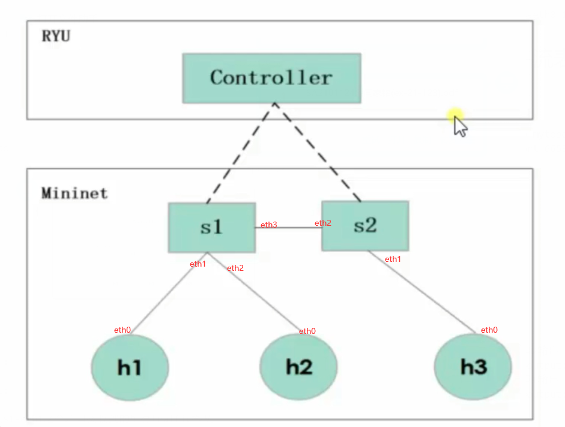

#   mininet介绍  
## 一、Mininet是什么

Mininet是由斯坦福大学基于Linux Container架构开发的一个进程虚拟化网络仿真工具，可以创建一个包含主机，交换机，控制器和链路的虚拟网络，其交换机支持OpenFlow，具备高度灵活的自定义软件定义网络。
## 二、Mininet可以做什么

1.  为OpenFlow应用程序提供一个简单，便宜的网络测试平台；  
2.  启用复杂的拓扑测试，无需连接物理网络；
3.  具备拓扑感知和OpenFlow感知的CLI，用于调试或运行网络范围的测试；
4.  支持任意自定义拓扑，主机数可达4096，并包括一组基本的参数化拓扑；
5.  提供用户网络创建和实验的可拓展Python API。

##  三、Mininet的优势

>Mininet结合了许多仿真器，硬件测试床和模拟器的有优点：

1.  与仿真器比较：启动速度快；拓展性大；带宽提供多；方便安装，易使用。
2.  与模拟器比较：可运行真实的代码；容易连接真实的网络。
3.  与硬件测试床比较：便宜；快速重新配置及重新启动。

##  四、Mininet的主要特性

>Mininet作为一个轻量级软定义网络研发和测试平台，其主要特性包括：

1.  支持OpenFlow、Open vSwitch等软定义网络部件；
2.  方便多人协同开发；
3.  支持系统级的还原测试；
4.  支持复杂拓扑、自定义拓扑；
5.  提供python API；
6.  很好的硬件移植性（Linux兼容），结果有更好的说服力；
7.  高扩展性，支持超过4096台主机的网络结构。

#   Mininet安装

>Mininet安装主要有三种方法，安装过程参见(http://mininet.org/download/):
+   使用装有Mininet的虚拟机
+   github获取安装Mininet源代码(推荐)
+   Mininet文件包安装

>方法二简要安装过程：
```
#1. 下载源码
git clone git://github.com/mininet/mininet

#2. 进入mininet/util目录,查看安装选项
./install.sh -h

#3. 安装mininet
./install -n3V 2.5.0  #安装ovs2.5
./install -a          #全部安装
```

# Mininet命令

测试安装是否完成
```
sudo mn --test pingall      #显示Cleanup complete.
```
启动mininet
```
mn
```
常用交互命令
```
#nodes              查看全部节点 
#net                查看链路信息 
#dump               输出各节点的信息 
#h1 ping -c 4 h2    测试主机之间的连通性 
#iperf              两个节点之间用指定简单的 TCP 测试 
#iperfudp           两个节点之间用指定款单 udp 进行测试 
#noecho             运行交互窗口，关闭回应 
#pingpair           两个主机将互 ping 
#help               列出命令文档，查看命令帮助： help command 
#dpctl              流表类操作 
#exit/quit          退出 mininet 命令行 
#hX ifconfig        查看当前那主机的 ip 地址，如： h1 ifconfig 
#py/sh              执行 python 表达式或运行外部 shell 程序 
```
python添加节点
```
py net.addHost('h3')
py net.addLink(s1,net.get('h3'))
py s1.attach('s1-eth3')
py net.get('h3').cmd('ifconfig h3-eth0 10.0.0.3')
```

# Mininet实战1————流表
>本实验的拓扑结构  


[实验1拓扑代码](./exper1.py) 
```
sudo mn --custom exper1.py --topo mytopo --controller=remote,ip=127.0.0.1,port=6653
```
 
常用命令(对所有的流表执行操作)
```
#查看
dpctl dump-flows
#删除
ddpctl del-flows

```

## **添加流表测试主机间通信**
```
#添加流表，使得进入端口为1的，向端口2输出
dpctl add-flow in_port=1,actions=output:2
#添加流表，使得进入端口为2的，向端口1输出
dpctl add-flow in_port=2,actions=output:1
```
解释：用dpctl对交换机添加flow，让交换机从s1-eth1这个端口接收到的所有traffic都从s1-eth2这个端口发出去。用dpctl给交换机添加双向流表，因为ping包除了echo request还有echo reply。所以还需要用dpctl对交换机添加flow，让交换机从s1-eth2这个端口接收到的所有traffic都从s1-eth1这个端口发出去。添加这两条flow后，h1能够ping通h2。  


## **添加协议流表使h1/h2通信**


>执行如下命令添加两条traffic类型为IPv4（0x0800）协议相关的flow entry，并查看下发的流表。
```
dpctl add-flow dl_type=0x0800,nw_dst=10.0.0.2,actions=output:2
dpctl add-flow dl_type=0x0800,nw_dst=10.0.0.1,actions=output:1
dpctl dump-flows

#在主机h1中执行如下命令分别ping主机h2和h3。
#结果：ping失败

```

原理解析:  
用dpctl对交换机添加flow，让交换机把所有EtherType为0x0800（IPv4）并且destiation IP为10.0.0.2的traffic从s1-eth2这个端口发出去。用dpctl对交换机添加flow，让交换机把所有EtherType为0x0800（IPv4）并且destiation IP为10.0.0.1的traffic从s1-eth1这个端口发出去。但处在同一网段下的主机，它们之间的交流是L2 forwarding，需要靠ARP来解析MAC地址，之前只匹配了0x0800(IPv4)协议，并没有匹配到0x0806(ARP)，这样当交换机收到h1的ARP包后，因为没有控制器，flow table里面也没有相应的flow告诉它如何转发这个ARP包，交换机只能将它丢弃，从而导致h1 ping h2失败，所以需要添加ARP协议的流表来使通信。    

  
>执行命令dpctl add-flow dl_type=0x0806,actions=NORMAL添加ARP（0x0806）协议相关的流表，让交换机以NORMAL形式（即广播）将所有ARP包从各个端口广播出去。
```
dpctl add-flow dl_type=0x0806,actions=NORMAL
#成功
```

#   Mininet实战2———模拟多数据中心流量带宽实验

##  案例目的
+   通过Mininet模拟搭建基于不同数据中心的网络拓扑
+   掌握多数据中心网络拓扑的构建
+   熟悉网络性能测试工具iperf，根据实验测试SDN网络性能
+   通过程序生成真实网络流量
## 流量模拟
网络性能评估中一个巨大的挑战就是如何生成真实的网络流量，可以通过程序来创造人工的网络流量，通过建立测试环境来模拟真实的情况。此应用主要以数据中心网络为目标场景，在mininet仿真环境中尽可能地还原数据中心内部地真实流量情况。