### 1.mininet 测试
1.  loss

```
##以tcp连接，5%的丢包率运行
mn --link=tc,loss=5

mininet>h1 ping -c 1000 -i 0.01 h2

##结果显示丢包率大约为18%
##原因：1-(1-5%)^4 =18...%
```


2.  iperf

```
mn --link=tc,loss=0,bw=10

mininet>xterm h1 h2

### h1作为client 以udp形式，设置带宽为20M,传输10次
h1# iperf -c 10.0.0.2 -u -b 20M -t 10

### h2 作为server 以1s间隔输出结果,以udp形式
h2# iperf -s -i 1 -u

##结果显示Bandwidth为9.7Mbits/sec
```

3.  delay

```
mn --link=tc,loss=0,bw=10,delay='10ms'

mininet> h1 ping -c 10 h2

##结果:time结果为41.5ms(来回四次+交换机处理时延)

```


### 2.iperf 绘图

下载绘图工具
```
apt install gnuplot
```
```
xterm h1 h2

h1#iperf -c 10.0.0.2 -t 10

h2#iperf -s -i 1 | tee tcp.txt

```

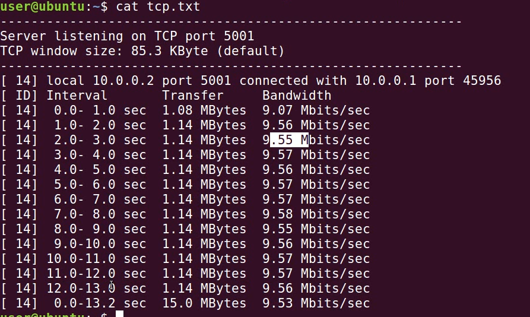

```
## 选取前十行
cat tcp.txt | grep sec |head -n 10 | tr "-" " " | awk '{print $4,$8}' > a


###显示结果
1.0 9.07
2.0 9.56
3.0 9.55
4.0 9.57
5.0 9.56
6.0 9.57
7.0 9.57
8.0 9.58
9.0 9.55
10.0 9.56
```

绘图
```
ubuntu$ gnuplot

gunplot>plot "a" title "tcp" with linespoints
gnuplot>set yrange[0:10];set ytics 0,1,10;set xrange[0:10];set xtics 0,1,10;replot
gnuplot>set xlabel "time(sec)";set ylabel "throughput(Mbps)";set title "TCP Throughput";replot
gnuplot>set terminal gif;set output "a.gif"
gnuplot>replot
```
结果
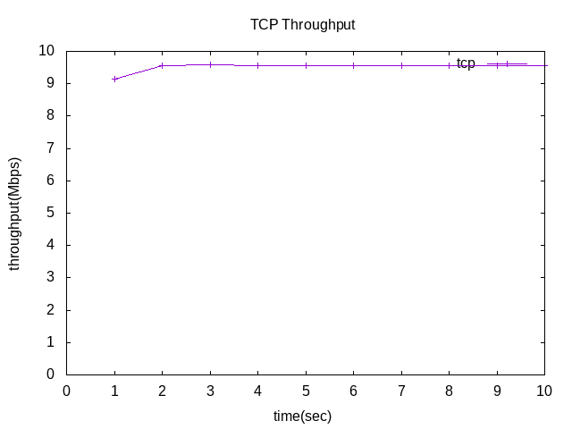

### 3.mininet Script

前三个简单的直接跳过

1.  编写4.py脚本构造如下的拓扑

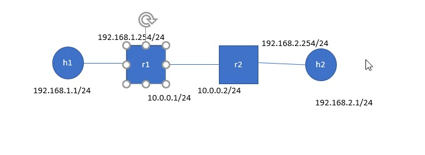

[代码见4.py](./net_topo/4.py)


1.  编写5.py脚本构造如下的拓扑

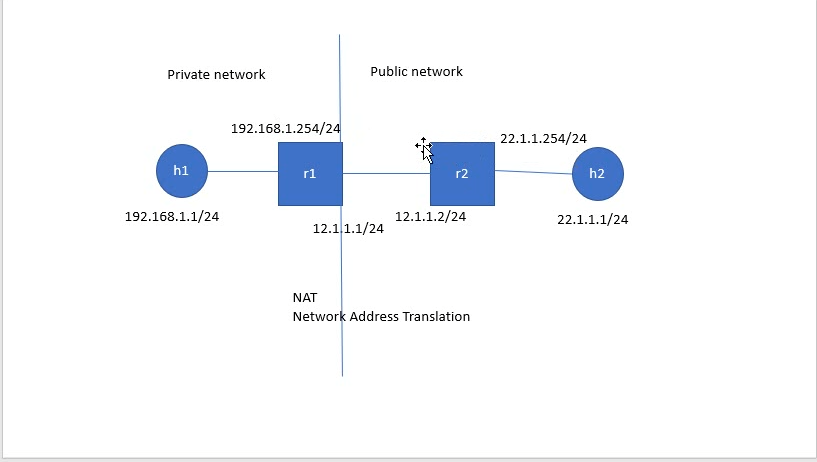

[代码见5.py](./net_topo/5.py)


3.  作业：构造如下的拓扑

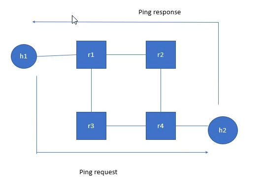

[代码见assign.py](./net_topo/assign.py)

**说明：目前h1 ping h2 时，只走路由r3
但是 h2 ping h1 时，request经过r2,reply经过r3  
原因：目前不知道**


Tips:
```
##复制时出现空白行
sed -i '/^$/d ' 2.py
```

```
##清除ip
ifconfig h1-eth0 0

##设置ip
ifconfig h1-eth0 192.168.1.1/24
ip route add default via 192.168.1.254

```


### 4.Bridge

安装bridge相关包
```
sudo apt install bridge-utils
```

1. [br1.py](./bridge/br1.py)


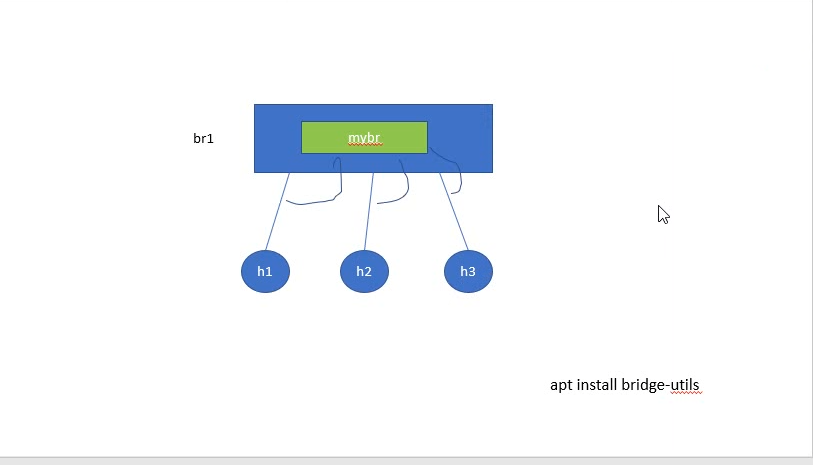


2.  [br2.py](./bridge/br2.py)


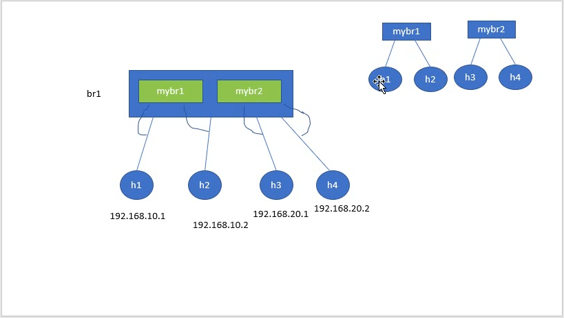


3.  [br3.py](./bridge/br3.py)

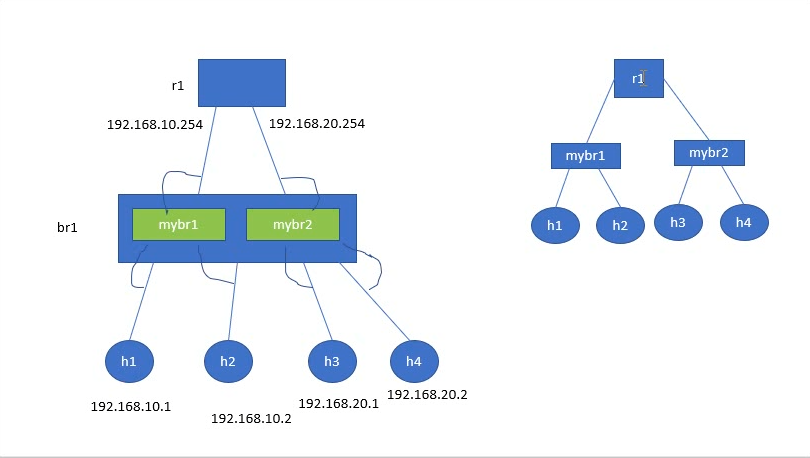


### 5.VLAN + bridge

安装vlan
```
sudo apt install vlan
```
4.  [br4.py](./vlan/br4.py)

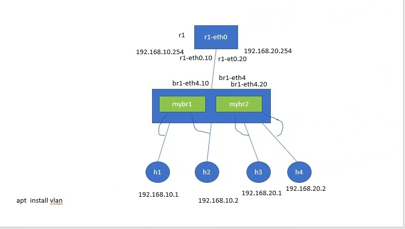

### 6.OVS

1.  controller 消失

```
sudo mn --topo single,2

mininet>h1 ping h2 

##成功

##当把controller进程杀死时，ping 失败
```

杀死进程后
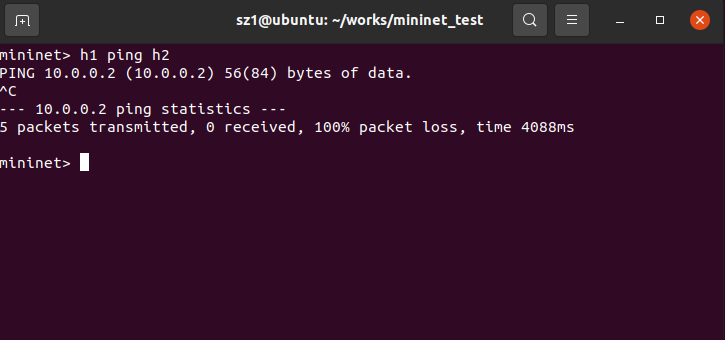

2.  解决办法

```
#root用户下
#ovs基本命令
ovs-ofctl show s1

#删除流表
ovs-ofctl del-flows s1

#查看流表
ovs-ofctl dump-flows s1

#此时流表为空，控制器不存在，为s1添加两条流表
ovs-ofctl add-flow s1 in_port=1,actions=output:2
ovs-ofctl add-flow s1 in_port=2,actions=output:1


# 
mininet>h1 ping h2 -c 3
#成功
#再次查看dum_flows，如下图出现n_packet =5
#原因:arp请求和arp单播回复
```

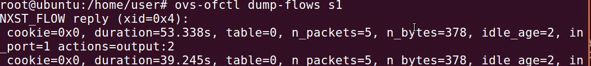


### 7.SSH

1.  构造拓扑

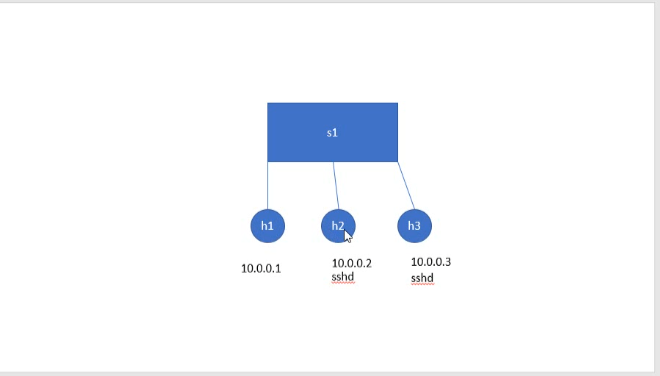

```
sudo mn --topo single,3
mininet>xterm h1 h2 h3

## -t:tcp -u:udp -n:不解析 -l:listen -p:process id
h1# netstat -tunlp |grep 22
h2# netstat -tunlp |grep 22
h3# netstat -tunlp |grep 22

#查找 sshd目录
h2#which sshd
#在mininet环境启动sshd
h2#/usr/sbin/sshd
#再次查看22端口:发现进程已启动，可以使用ssh连接
h2# netstat -tunlp |grep 22

h1# ssh user@10.0.0.2
```

### 8.Containernet

1.  下载源码
```
git clone https://github.com/containernet/containernet.git
```

2. 安装 containernet

```
#python包依赖
pip3 install docker

##安装
python3 ./setup.py install
```

3.  安装docker

[reference](https://www.runoob.com/docker/ubuntu-docker-install.html)

4.  docker启动

```
#
docker pull ubuntu:16.04
docker images

docker run -it ubuntu:16.04 bash

```

```
root node#apt install openssh-server -y
root node#apt install net-tools
root node#apt install iputils-ping
root node#adduser user

##为创建两个images,设置不同的密码
root node#passwd
```
```
##构建两个镜像
docker commit 96c71559ced5 ubuntu:sshd1
docker commit 96c71559ced5 ubuntu:sshd2
```

containernet目录下执行 python3 1.py  

[构建拓扑](./Containernet/1.py)

```
1.d1 d2 内 IP地址需要检查
2.设置ssh服务打开
/etc/init.d/ssh start

netstat -tunlp |grep 22
```


### 9.ReverseProxy    --frp

1.  go语言环境安装

```
##ubuntu上root用户安装go
##预设路径 /usr/lib/go-1.17/bin

add-apt-repository ppa:longsleep/golang-backports
apt update
apt install golang-go

```

2.  frp

```
## ReverseProxy目录下
git clone https://github.com/fatedier/frp.git
##
cd frp

make
##显示如下内容则成功
go fmt ./...
go: downloading...
go: downloading...
env CGO_ENABLED=0 go build -trimpath -ldflags "-s -w" -o bin/frps ./cmd/frps
env CGO_ENABLED=0 go build -trimpath -ldflags "-s -w" -o bin/frpc ./cmd/frpc


#将bin/frpc bin/frps拷贝
cd bin
cp frpc frps ../conf

#切换目录至ReverseProxy
cd ..
cd ..


```

3.  构建拓扑

[代码见1.py](./ReverseProxy/1.py)

```
#
python 1.py

mininet>xterm h1 h1 h2 h3
```

```
##h1 ip 192.168.1.1
## h2 ip 1.1.1.1
## h3 ip 2.2.2.2

h1#ping 1.1.1.1         #成功
h1#ping 2.2.2.2         #成功
h2#ping 192.168.1.1     #失败
```
4.  主机配置ini

>最终目的希望外网h3可以存取h1的网页

```
##h1开启简单的服务器（不能用python3)
h1# python -m SimpleHTTPServer 80
```

```

#h2 主机 切换到 frp/conf目录
##编辑frps.ini
```
[frps.ini](./ReverseProxy/h2_ini/frps.ini)
说明:
bind_port = 7000是使得h1 通过7000端口号连接到h2
vhost_http_port = 8080是h3 与 h2连接使用的端口

```
##编辑完成ini
##conf目录下运行frps
./frps -c frps.ini

##显示如下内容，后面h1会运行frpc与h2的7000端口连接，h3与h2的8080端口连接，从而达到h3访问h1网页
##0.0.0.0含义
1.开机自动取ip时候，表示尚未取得ip
2.此处any interface
```


```
##用另一个h1的视窗进入conf目录
##编辑frpc.ini

```
[frpc.ini](./ReverseProxy/h1_ini/frpc.ini)

```
##执行
./frpc -c frpc.ini
##结果显示：h1显示第一幅图，h2显示第二幅图
```


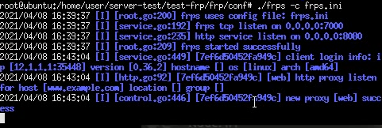

5.  h3连接h1

此时h3不能直接根据ip地址curl，否则h1不会反馈

```
vim /etc/hosts
##添加如下内容
1.1.1.1     www.example.com
##
curl  www.example.com:8080
```

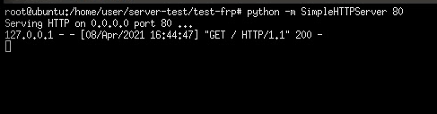


Tips:
```
frps.ini frpc.ini 可以提前修改
```


### 10.SSHTunnel

### 11.OVS_operate

1.  lab1

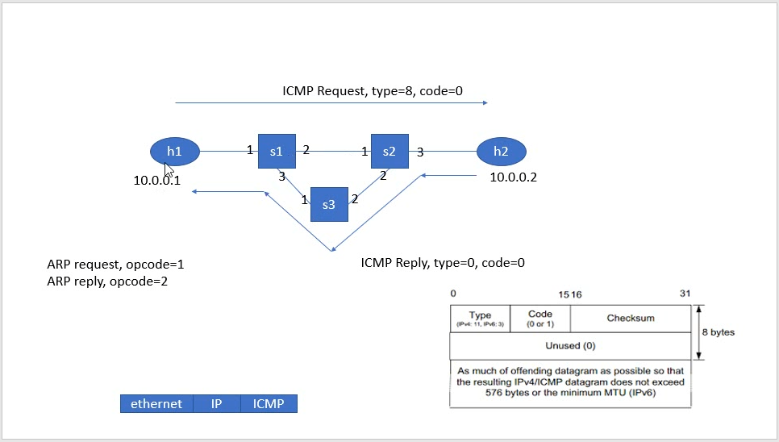

说明：
```
###arp
在ovsjiao交换机中，arp使用的是单播;
arp request 时，arp_op = 1
arp reply  时， arp_op = 0

###ICMP
icmp request, icmp_type=8,icmp_code=0
icmp reply  , icmp_type=0,icmp_code=0
```

2.  lab2

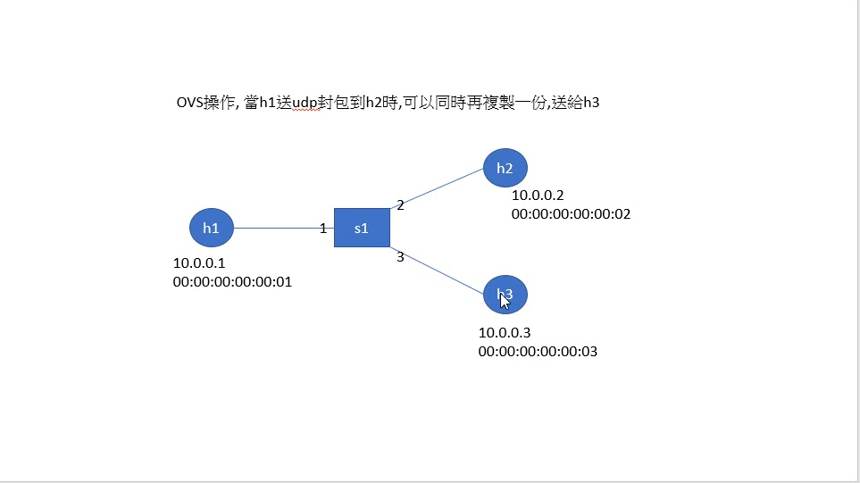

说明：
```
将priority变大，同时增加 mod_dl_dst mod_nw_dst,即可在传输的时候
h1#iperf -c 10.0.0.2 -u -b 1M -t 10
h2#iperf -s -i 1 -u
h3#iperf -s -i 1 -u
h2 与 h3 都可以收到

```